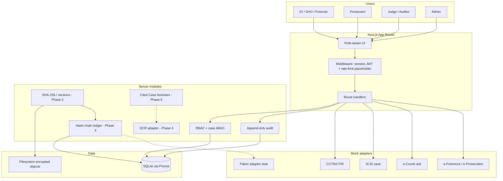

# NyayaVault architecture

Prototype for . Complementary document-integrity layer — **not** a replacement for ICJS, CCTNS, e-Courts, e-Sakshya, e-Prosecution, or e-Forensics.

## Component diagram

## Runtime choice

A **single Next.js process** keeps `npm run dev` simple for the . Storage, OCR, LLM, search, and ledger are **adapter interfaces** so Postgres, MinIO, OpenSearch, Tesseract, a live model, or Fabric can be swapped later without claiming they are already live.

## Data flow (Phase 1)

1. User submits email/password. Failed logins are audited.
2. If `mfaEnabled`, a demo OTP (`DEMO_OTP`) is required.
3. Server sets an HttpOnly JWT cookie (`nv_session`) with `sub`, role, name, email. **Case assignments are not trusted from the client**; they are loaded from the database on each authorization check.
4. Case pages and `GET /api/cases/:id` call `authorizeCase`, which evaluates role, assignment, and classification, then writes `ACCESS_ALLOWED` or `ACCESS_DENIED`.
5. Role switcher (when `DEMO_ROLE_SWITCH=true`) issues a new session and writes `ROLE_SWITCH`.

## Later-phase flows (designed, not fully built)

Upload → MIME/size validation → encrypt to object store → immutable `DocumentVersion` → SHA-256 → hash-chain event → OCR/index → optional share/redact → RAG over permitted chunks only.

## What is stored where

| Store | Contents |
|---|---|
| SQLite | Users, cases, assignments, policies, documents metadata, versions metadata, audit, ledger events |
| Filesystem (Phase 2) | Encrypted file bytes |
| Hash chain | Hashes, event type, actor id, timestamps, proof id — **never** raw documents or PII |
| LLM (Phase 6) | Only retrieved, possibly redacted chunks for one authorized case |

## Production path

PostgreSQL + MinIO/S3 + TLS + KMS + real MFA + permissioned ledger adapter + official ICJS/CCTNS interfaces after authorization from NCRB/NIC.
